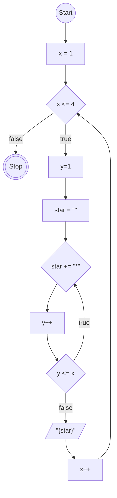

# Perulangan / Iterasi

Perulangan ini berfungsi untuk mencetak bintang berbentuk segitiga

## While

```mermaid

flowchart TD

A@{shape: circle, label: Start}
B@{shape: diamond, label: "x <= 4"}
C@{shape: rect, label: 'star = ""'}
D@{shape: dbl-circ, label: Stop}
E@{shape: rect, label: "y=1"}
F@{shape: diamond, label: "y <= x"}
G@{shape: diamond, label: 'star += "*"'}
H@{shape: rect, label: "y++"}
I@{shape: lean-r, label: '"{star}"'}
J@{shape: rect, label: "x++"}
K@{shape: rect, label: "x = 1"}

A --> K --> B
B --false--> D
B --true--> E --> C --> G 
F --false--> I --> J --> B 
F --true--> G --> H --> F
```

